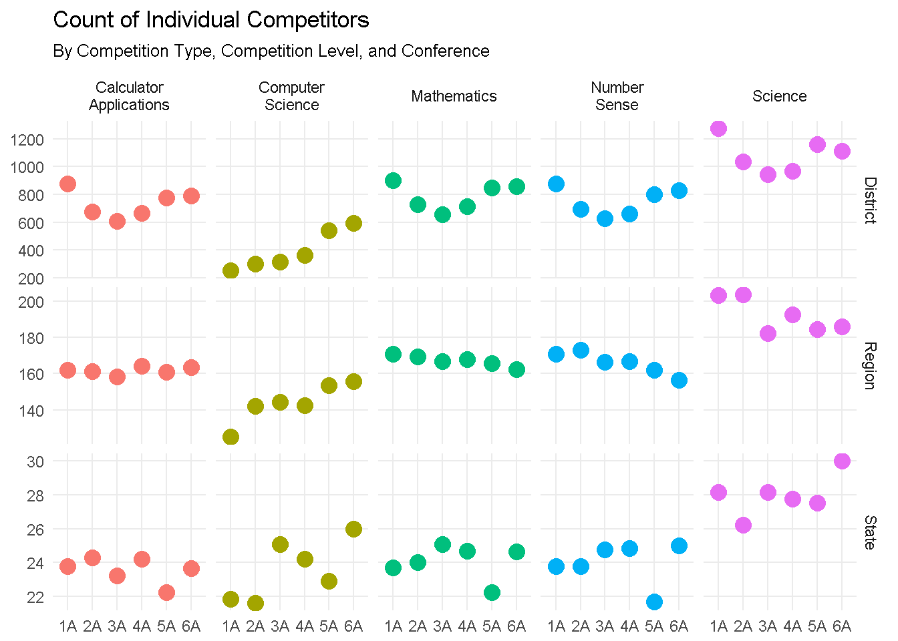
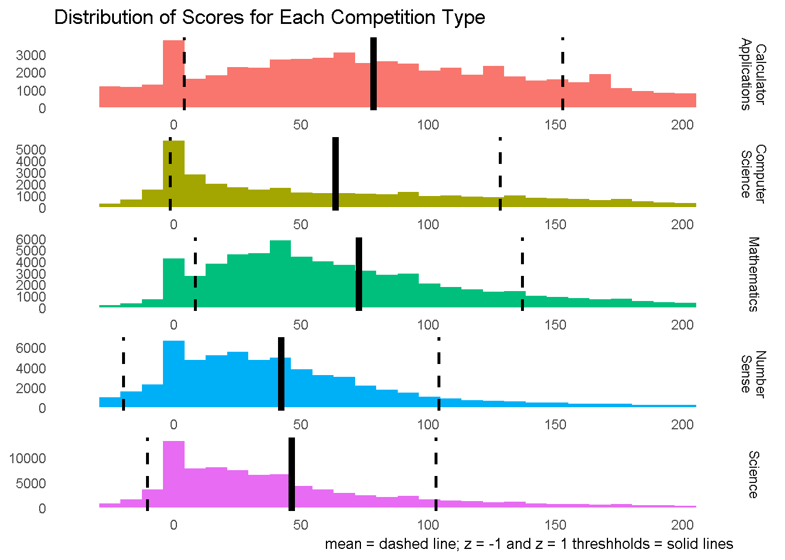
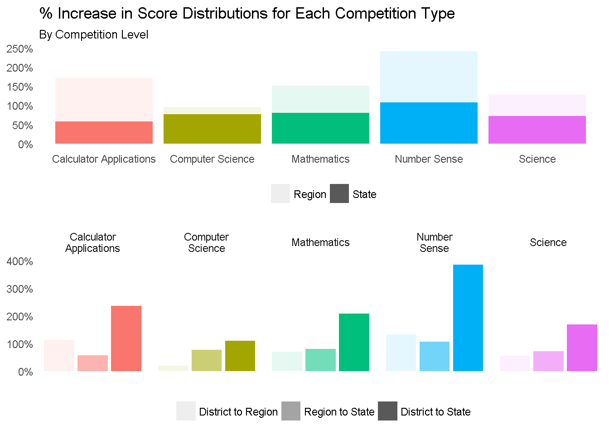
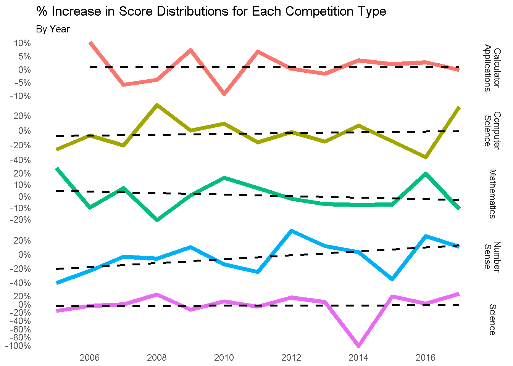
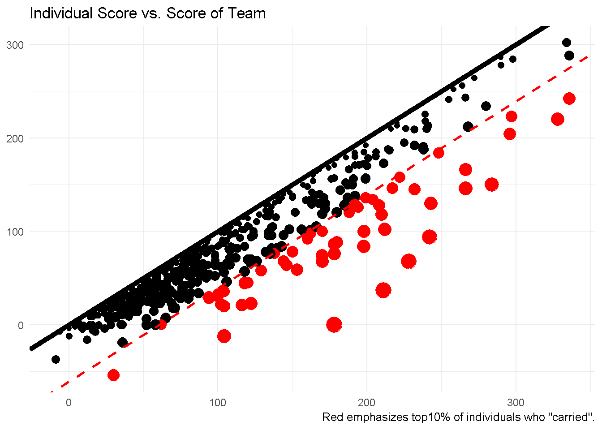

# Introduction

In this project I investigate the results of Texas high school
Academic University Interscholastic League (UIL) competitions.
Scripts were written to scrape, "munge", and analyze the data.
Thanks to <https://www.hpscience.net/> for posting the data used for this project.
 
## Motivation

(This secion is taken from the main deliverable of this project.)

Probably the main reason that I am interested in this subject is
because I myself competed in these competitions when I was in school!
I would like to know how I stacked up histogrically among all students.

Additionaly, aside from standardized testing, these competitions might be the best way
of identifiing "strong" sutdents and schools. In fact, given the competitive
nature of this domain, one could argue that these competitions provide
better gauges of "elite" sutdents and schools. Thus, analysis of competition
results is useful for revealing highly reputable schools and spotlighting
superior students.

Finally, as if I needed any other excuse to invesitgate this data,
I saw this data set as a great opportunity to practice my
`#rstats` and `#datascience` skills.

# Highlights

These are just some of the visualizations generated in the deliverable.
See the `output` folder in this repo for the full report.

## Number of Competitors

## Raw Score Distributions

## Score Distributions by Competition Level

## Change in Score Distributions

## Individual vs. Team Contributions

